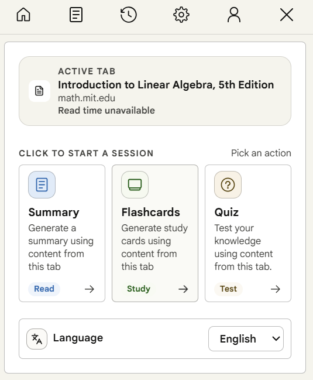
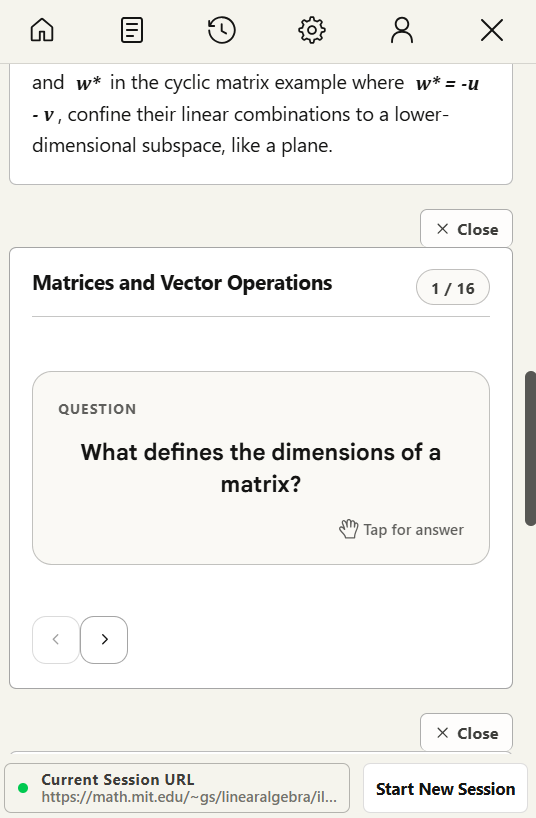
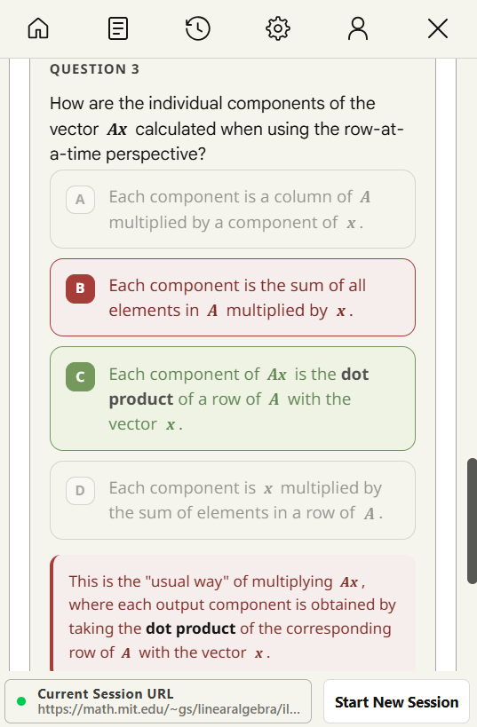
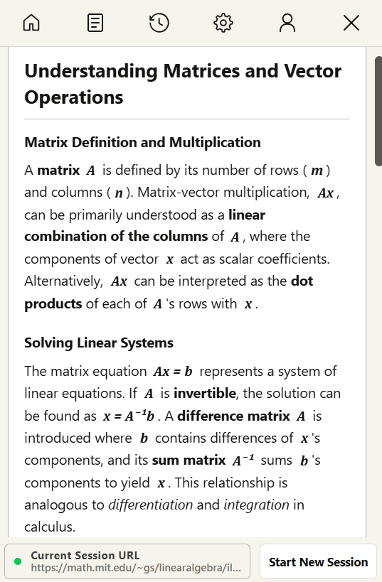

# ReadToRecall

A Chrome extension that uses AI to summarize webpages, YouTube videos, and PDFs — then turns them into flashcards and quizzes.

## Features

**Summarize anything in your browser**
- Webpages, articles, research papers, blog posts
- YouTube video transcripts (auto-extracted)
- PDFs

**Multiple summary formats** — Paragraph, Bullet Points, TL;DR, Key Takeaways, Q&A, Pros & Cons, Action Items. Choose short, medium, or long.

**Flashcards** — Generate study cards from any summarized content. Navigate through them with a swipeable carousel.

**Quizzes** — Auto-generated multiple choice questions with adjustable difficulty. Get instant feedback on your answers.

**Multi-language** — Summarize in English, Spanish, French, Mandarin Chinese, or Hindi.

**Session history** — Access past summaries, flashcards, and quizzes from previous sessions.

**Themes** — Light and dark mode with adjustable font size.

## How It Works

1. Navigate to any webpage, YouTube video, or PDF
2. Click the ReadToRecall icon in your toolbar
3. Pick an action — Summary, Flashcards, or Quiz
4. View your results instantly in the popup

## Tech Stack

**Frontend** — React, TypeScript, Vite, Zustand, Tailwind CSS, Radix UI

**Backend** — Django REST Framework, PostgreSQL, Google Gemini API, Stripe

**Infrastructure** — Docker, Nginx, Gunicorn, JWT authentication, Google OAuth

## Plans

| | Free | Standard | Pro |
|---|---|---|---|
| Monthly summaries | 10 | 300 | 1,200 |
| History slots | 3 | 5 | 10 |
| Character limit | 10,000 | 30,000 | Unlimited |
| Flashcards & Quizzes | Yes | Yes | Yes |

## License

All rights reserved. Copyright 2026 Daniel Li.
